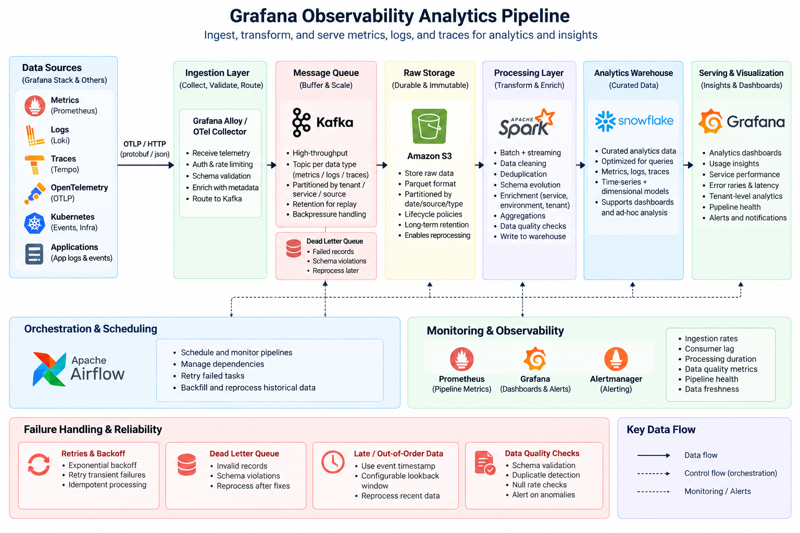

# Grafana Analytics Pipeline

A data pipeline design for ingesting, transforming, and serving observability data such as metrics, logs, and traces for analytics.

The main goal is to keep ingestion reliable, make the data easy to reprocess, and provide a clean analytics layer for dashboards and longer-term analysis.

## Architecture



## Pipeline Overview

```text
Grafana / OpenTelemetry
          |
          v
   Ingestion Layer
          |
          v
        Kafka
          |
          v
        S3
          |
          v
   Spark + Airflow
          |
          v
      Snowflake
          |
          v
      Grafana
